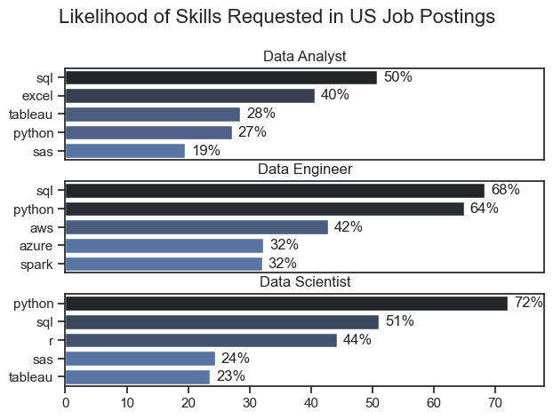

# The Analysis

## 1.  What are the most demanded skills for the top 3 most popular data roles?

To find the most demanded skills for the top 3 most popular data roles. I filtered out those positions by which ones were the most popular, and got the top 5 skills for these top 3 roles. This query highlights the most popular job titles and their top skills, showing which skills I should pay attention to depending on the role I'm targeting.

View my notebook with detailed steps here:
[2_Skill_Demand.ipynb](3_Project/2_Skill_Demand.ipynb)


### Visualize Data

```python
fig, ax = plt.subplots(len(job_titles), 1)

sns.set_theme(style='ticks')

for i, job_title in enumerate(job_titles):
    df_plot = df_skill_percent[df_skill_percent['job_title_short'] == job_title].head(5)
    # df_plot.plot(kind='barh', x='job_skills', y='skill_percent', ax=ax[i],  title=job_title)
    sns.barplot(data=df_plot, x='skill_percent', y='job_skills', ax=ax[i], hue='skill_percent', palette='dark:b_r')
    ax[i].set_ylabel('')
    ax[i].set_title(job_title)
    ax[i].set_xlim(0, 78)
    ax[i].set_xlabel('')
    ax[i].legend().set_visible(False)

    for n, v in enumerate(df_plot['skill_percent']):
        ax[i].text(v + 1, n, f'{int(v)}%', va= 'center')

    if i != len(job_titles) - 1:
      ax[i].set_xticks([])

fig.suptitle('Likelihood of Skills Requested in US Job Postings', fontsize=16)
plt.tight_layout(h_pad=0.2)

plt.show() 
```

### RESULTS




### Insight

SQL is essential across all roles, with high demand for Data Analysts (50%), Data Engineers (68%), and Data Scientists (51%).

Python is crucial for Data Scientists (72%) and Data Engineers (64%) but less emphasized for Data Analysts (27%).

Data Analysts rely on business intelligence tools, with Excel (40%) and Tableau (28%) being key skills.

Data Engineers need cloud and big data skills, including AWS (42%), Azure (32%), and Spark (32%).

R is mainly required for Data Scientists (44%), reflecting its role in statistical computing.
Distinct skill sets:

Data Analysts focus on BI tools and SQL.
Data Engineers specialize in databases and cloud technologies.
Data Scientists emphasize programming and statistical modeling.
 
