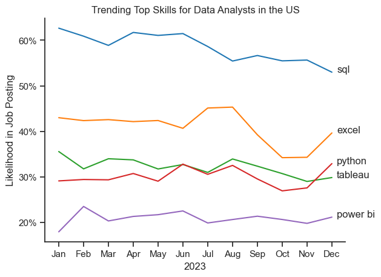
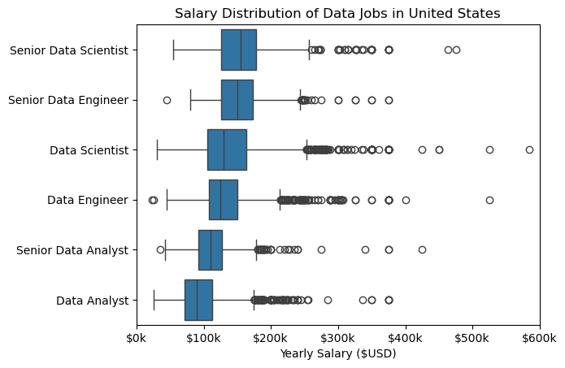
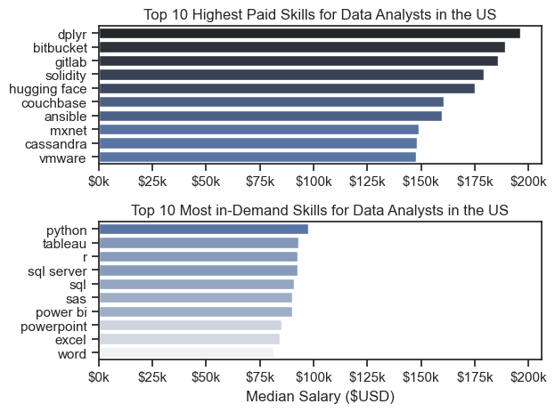
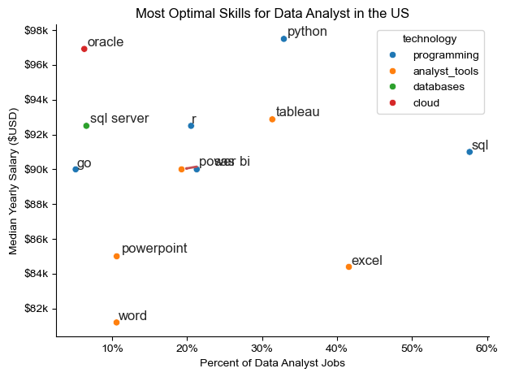

Welcome to my analysis of the data job market, with a focus on data analyst roles. This project stems from my interest in understanding industry trends and identifying the most valuable skills for career growth. By examining both high-paying and in-demand skills, I aim to provide insights that can help data analysts optimize their job opportunities.

The data for this analysis is sourced from Luke Barousse's Python Course, which offers a comprehensive foundation covering job titles, salaries, locations, and essential skills. Using Python scripts, I explore key questions such as the most sought-after skills, salary distributions, and the balance between skill demand and earning potential in data analytics.

# The Questions
1. What are the skills most in demand for the top 3 most popular data roles?

2. How are in-demand skills trending for Data Analysts?

3. How well do jobs and skills pay for Data Analysts?

4. What are the optimal skills for data analysts to learn? (High Demand AND High Paying)

# Tools i Used
For my deep dive into the data analyst job market, I harnessed the power of several key tools:

- Python: The backbone of my analysis, allowing me to analyze the data and find critical insights. I also used the following Python libraries:

  &#9675; Pandas Library: This was used to analyze the data.
  
  &#9675; Matplotlib Library: I visualized the data.
  
  &#9675; Seaborn Library: Helped me create more advanced visuals.

- Jupyter Notebooks: The tool I used to run my Python scripts which let me easily include my notes and analysis.

- Visual Studio Code: My go-to for executing my Python scripts.

- Git & GitHub: Essential for version control and sharing my Python code and analysis, ensuring collaboration

# Data Preparation and Cleanup

This section outlines the steps taken to prepare the data for analysis, ensuring accuracy and usability.

## Import & Clean up Data
The first step in data analysis is importing the dataset from the database. Once imported, the data undergoes a cleaning process to ensure its quality. This involves handling missing values (by either imputing or removing them), removing duplicate entries, and converting data into appropriate formats. Additionally, outliers are identified and addressed, and categorical variables are encoded into numerical values when necessary. By transforming the data into a consistent and usable format, we ensure that the analysis is accurate and reliable.

# The Analysis
Each Jupyter notebook for this project aimed at investigating specific aspects of the data job markets. Here is how I approach each question:

## 1.  What are the most demanded skills for the top 3 most popular data roles?

To find the most demanded skills for the top 3 most popular data roles. I filtered out those positions by which ones were the most popular, and got the top 5 skills for these top 3 roles. This query highlights the most popular job titles and their top skills, showing which skills I should pay attention to depending on the role I'm targeting.

View my notebook with detailed steps here:
[2_Skill_Demand.ipynb](3_Project/2_Skill_Demand.ipynb)


### Visualize Data

```python
fig, ax = plt.subplots(len(job_titles), 1)

sns.set_theme(style='ticks')

for i, job_title in enumerate(job_titles):
    df_plot = df_skill_percent[df_skill_percent['job_title_short'] == job_title].head(5)
    # df_plot.plot(kind='barh', x='job_skills', y='skill_percent', ax=ax[i],  title=job_title)
    sns.barplot(data=df_plot, x='skill_percent', y='job_skills', ax=ax[i], hue='skill_percent', palette='dark:b_r')
    ax[i].set_ylabel('')
    ax[i].set_title(job_title)
    ax[i].set_xlim(0, 78)
    ax[i].set_xlabel('')
    ax[i].legend().set_visible(False)

    for n, v in enumerate(df_plot['skill_percent']):
        ax[i].text(v + 1, n, f'{int(v)}%', va= 'center')

    if i != len(job_titles) - 1:
      ax[i].set_xticks([])

fig.suptitle('Likelihood of Skills Requested in US Job Postings', fontsize=16)
plt.tight_layout(h_pad=0.2)

plt.show() 
```

### RESULTS


### Insight

SQL is essential across all roles, with high demand for Data Analysts (50%), Data Engineers (68%), and Data Scientists (51%).

Python is crucial for Data Scientists (72%) and Data Engineers (64%) but less emphasized for Data Analysts (27%).

Data Analysts rely on business intelligence tools, with Excel (40%) and Tableau (28%) being key skills.

Data Engineers need cloud and big data skills, including AWS (42%), Azure (32%), and Spark (32%).

R is mainly required for Data Scientists (44%), reflecting its role in statistical computing.
Distinct skill sets:

Data Analysts focus on BI tools and SQL.
Data Engineers specialize in databases and cloud technologies.
Data Scientists emphasize programming and statistical modeling.


## 2.  How are in-demand skills trending for Data Analysts?

To find how skills are trending in 2023 for Data Analysts, I filtered data analyst positions and grouped the skills by month of the job postings. This git me the top skills of data analysts by month, showing how popular skills were throughout 2023.

View my notebook with detailed steps here: [3_Skills_Trend](3_Project/3_Skills_Trend.ipynb)
```python
from matplotlib.ticker import PercentFormatter
ax = plt.gca()
ax.yaxis.set_major_formatter(PercentFormatter(decimals=0))

for i in range(5):
    plt.text(11.2, df_plot.iloc[-1, i], df_plot.columns[i])

plt.legend([], [], frameon=False)  # Hide the legend properly
plt.show()
```

### Results

*Bar graph visualizing the trending top skilld for data analysts in the US in 2023*

### Insights:
- SQL remains the top priority skill for Data Analysts.
- Python is growing and competing with Tableau, making it an important technical skill.
- Power BI is growing but still lags behind Tableau in visualization tools.
- Excel remains essential and might surge at specific periods of the year.

## 3 How well do jobs and skills pay for Data Analysts?
To identify the highest-paying roles and skills, I only got jobs in the United States and looked at their median salary. But first i looked at the salary distributions on common data jobs like Data Scientist, Data Engineer, and Data Analyst, to get an idea of which jobs are piad the most.

View my notebook with detailed steps here: [4_Salary_Analysis](3_Project/4_Salary_Analysis.ipynb)

#### Visualise Data

```python
sns.boxplot(data=df_US, x='salary_year_avg', y='job_title_short')

plt.xlabel('Yearly Salary ($USD)')
plt.title('Distribution of Yearly Salaries in United States')
ax = plt.gca()
ax.xaxis.set_major_formatter(plt.FuncFormatter(lambda m, pos: f'${int(m/1000)}k'))
plt.xlim(0, 600000)
plt.ylabel('')
plt.show()
```

*Box plot visualising the salary distributions for the top 6 data job titles*
#### Insights
- Salary Trends by Job Role
Senior Data Scientists and Senior Data Engineers earn the highest salaries overall.
Data Scientists and Data Engineers have a similar salary range, slightly lower than their senior counterparts.
Senior Data Analysts earn less than Data Scientists and Engineers.
Data Analysts have the lowest salaries among these roles

- Salary Distribution
All roles have a wide salary distribution, suggesting significant variation in salaries due to experience, location, industry, and company size.
Data Science and Engineering roles show many outliers, meaning some professionals earn significantly more than the majority.

- Outliers and High Salaries
High salaries ($300k–$500k) are present for Data Science and Engineering roles, indicating some very high-paying positions.
Data Analysts and Senior Data Analysts have fewer high-end outliers, suggesting less salary variation at the top end.

- Final Takeaways
Data Scientists and Data Engineers are in high demand and earn competitive salaries.
Senior roles significantly boost earnings, making career progression crucial.
The wide distribution and outliers in high salaries suggest that experience, industry, and employer matter greatly.
Data Analysts have lower median salaries but provide a good entry point into data careers.

## 3 How well do jobs and skills pay for Data?
### Highest Paid and MOst Demanded Skills for Data Analysts
#### Visualize Data

```python
# Top 10 Highest Paid Skills for Data Analysts in the US
sns.barplot(data=df_DA_top_pay, y=df_DA_top_pay.index, x='median', ax=ax[0], hue='median', palette ='dark:b_r')
ax[0].legend_.remove()


# Top 10 Most in-Demand Skills for Data Analysts in the US
sns.barplot(data=df_DA_skills, y=df_DA_skills.index, x='median', ax=ax[1], hue='median', palette = 'light:b')
ax[1].legend_.remove()

plot.show()
```


*Two Separatr bar graphs visualizing the highest paid and most in-demand skills for data analysts in the US.*


#### Key insights
- Highest-Paid Skills: Specialized technical skills like dplyr, bitbucket, gitlab, solidity, hugging face, and couchbase command salaries above $150K–$200K, mainly in AI/ML, DevOps, cloud, and blockchain.
- Most In-Demand Skills: General data analysis tools such as Python, SQL, R, Tableau, and Power BI are highly sought after, with salaries in the $75K–$100K range.
- Key Takeaways:
1. Specialized skills lead to higher salaries but lower demand.
2. General data skills offer higher job availability but moderate pay.
3. Learning Python, SQL, and visualization tools (Tableau, Power BI) is essential for data analysts.
4. To maximize earnings, consider niche areas like AI, cloud computing, and blockchain.

# The Analysis
## What is the most optimal skill to learn for Data Analysts?

```python
from adjustText import adjust_text

# df_plot.plot(kind='scatter', x='skills_percent', y='median_salary')
sns.scatterplot(
    data=df_plot,
    x='skills_percent',
    y='median_salary',
    hue='technology'
)

sns.despine()
sns.set_theme(style='ticks')

texts = []

for i, txt in enumerate(df_DA_skills_high_demand.index):
    texts.append(plt.text(df_DA_skills_high_demand['skills_percent'].iloc[i], df_DA_skills_high_demand['median_salary'].iloc[i], txt))

adjust_text(texts, arrowprops=dict(arrowstyle="->", color='r', lw=2))

import matplotlib.ticker as mticker
from matplotlib.ticker import PercentFormatter
ax = plt.gca()

# Format x-axis with commas
ax.xaxis.set_major_formatter(PercentFormatter(decimals=0))

ax.yaxis.set_major_formatter(plt.FuncFormatter(lambda y, pos: f'${int(y/1000)}k'))

plt.xlabel('Percent of Data Analyst Jobs')
plt.ylabel('Median Yearly Salary ($USD)')
plt.title('Most Optimal Skills for Data Analyst in the US')
plt.tight_layout()
plt.show()
```


*A scatter plot visualising the most optimal skills (high paying an dhigh demand) for data analysts in the US*

#### Insight
1. SQL is the most in-demand skill

- It appears in nearly 60% of data analyst job postings, making it the most sought-after skill.
Despite its high demand, its median salary (~$90k) is not the highest among the listed skills.

2. Python commands a high salary but is less common than SQL

- Python has one of the highest median salaries (~$97k) but is required in fewer job postings compared to SQL.
- This suggests that Python proficiency may be more valuable in specialized or higher-paying roles.

3. Databases like Oracle and SQL Server offer strong salary potential

- Oracle offers the highest salary (~$98k) but is in lower demand compared to SQL.
- SQL Server also commands a competitive salary (~$93k) and is more in demand than Oracle.

4. Analyst tools like Tableau and Power BI are moderately demanded but pay well

- Tableau and Power BI are sought after in about 20-30% of jobs, offering salaries in the $88k-$92k range.
- These tools are valuable for data visualization and business intelligence roles.

5. Microsoft Office tools (Excel, Word, PowerPoint) are common but pay less

- Excel is highly demanded (~40%), but its median salary (~$85k) is lower than that of SQL, Python, or Tableau.
- Word and PowerPoint have lower salaries (~$82k-$84k) and are in much lower demand (~10-20%), indicating they are supplementary rather than primary skills.

### Takeaways for a Data Analyst:
- SQL is a must-have skill due to its high demand.
- Python is highly valuable for higher-paying roles.
- Database management (Oracle, SQL Server) can boost earning potential.
- Visualization tools (Power BI, Tableau) are beneficial but not as lucrative as Python or databases.
- Basic office tools (Excel, Word, PowerPoint) are necessary but not sufficient for high salaries.